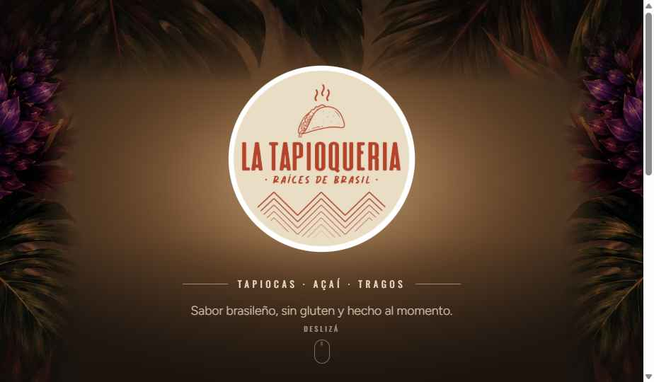
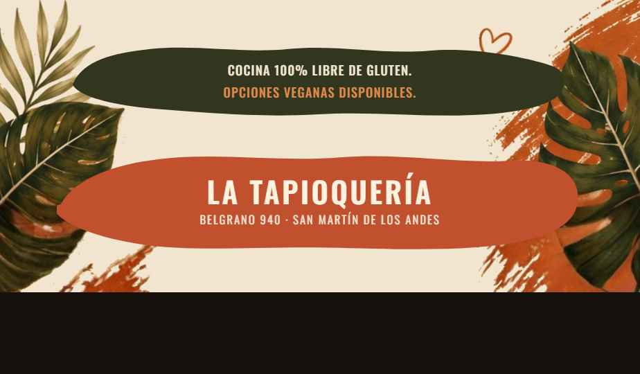

<div align="center">

# 🫓 La Tapioquería

**Tapiocas, tragos y más — San Martín de los Andes, Argentina**



</div>

Sitio web de **La Tapioquería**, resto bar de tapiocas brasileñas en Belgrano 940, San Martín de los Andes. Cuatro páginas — inicio, carta, ubicaciones y la historia del producto — en **español, inglés y portugués de Brasil**, con **PHP simple** (sin framework, sin build).

## ✨ Trabajo realizado

Este repo arrancó como una exportación directa de la herramienta de diseño: imágenes de varios MB sin optimizar, nombres de archivo con espacios y tildes, cero metadata SEO y un link interno roto. Quedó así:

| Antes | Después |
| --- | --- |
| Imágenes del sitio pesaban hasta **3.5MB cada una** (~25.9MB en total) | Todas optimizadas a **≤100KB** (~1.44MB en total) → **‑94%** |
| El video de "Cómo se hace" pesaba **42MB** (vertical, sin comprimir) | Comprimido a **4.1MB** (‑90%) manteniendo su formato vertical original, con contenedor y poster propios |
| Sin `<title>`, `meta description` ni Open Graph en ninguna página | Las 4 páginas con SEO on-page completo (`title`, `description`, `og:*`, `lang="es"`, datos estructurados JSON-LD, favicon/manifest) |
| Nombres de archivo con espacios y tildes (`"Donde encontrarnos.dc.html"`) | Kebab-case limpio (`donde-encontrarnos.html`) — URLs estables y sin problemas de encoding |
| El link **"← Volver"** apuntaba a un nombre de archivo con guion largo (`—`) que no coincidía con el archivo real | Corregido — el link funcionaba mal en las 3 subpáginas y nadie lo había notado |
| Sin redes sociales ni contacto directo (solo un link de texto a Instagram en 2 de 4 páginas) | Instagram, Facebook y WhatsApp en el footer de las 4 páginas + botón flotante de WhatsApp |
| Huecos de contenido: 7 slots de imagen vacíos y un `<video>` sin fuente | Las 4 fotos del FoodTruck Lolog y el video ya están cargados; no quedan huecos de contenido |
| ~14MB de archivos huérfanos mezclados con los assets reales del sitio | Archivados en `_unused/` (fuera del repo, en `.gitignore`) |
| Sin repo, sin punto de entrada para hosting estático | Git inicializado + `index.html` como home real + `robots.txt`, listo para desplegar en cualquier host estático |
| Construido en Claude Design (`.dc.html`, estilos inline, runtime propietario) | Migrado a HTML + CSS estático convencional, y luego a PHP simple (2026-09-25) para poder ofrecer 3 idiomas sin triplicar el HTML a mano |
| Solo en español | Español (default), inglés (`/en/`) y portugués de Brasil (`/pt/`), con `hreflang`/canonical/JSON-LD correctos por idioma |

Detalle completo de cada punto en [`docs/`](docs/).

## 🗺️ Páginas

| Página | Contenido |
| --- | --- |
| [`index.php`](index.php) | Hero, acceso a las otras 3 secciones |
| [`menu.php`](menu.php) | Carta completa con precios (tapiocas, para picar, papas, platos) |
| [`donde-encontrarnos.php`](donde-encontrarnos.php) | Resto Bar (todo el año) + FoodTruck en el Lago Lolog (verano) |
| [`que-es-una-tapioca.php`](que-es-una-tapioca.php) | Qué es una tapioca, origen brasileño, cómo se hace |

<div align="center">

</div>

## 🧱 Stack

PHP simple: 4 páginas `.php` que comparten estructura vía `include`/`require` (`inc/`) y sacan todo su texto de diccionarios de traducción (`lang/es.php`, `lang/en.php`, `lang/pt.php`). Un `css/base.css` compartido (tokens de color/tipografía, footer, botón de WhatsApp, íconos sociales, selector de idioma) y un CSS propio por página. Sin framework, sin `package.json`, sin paso de build — necesita un hosting con PHP (Hostinger, por ejemplo) y `mod_rewrite` para las URLs limpias (`/menu`, `/en/menu`, `/pt/menu`). Detalle completo en [`CLAUDE.md`](CLAUDE.md).

## 📚 Documentación

- [`CLAUDE.md`](CLAUDE.md) — arquitectura del proyecto, convenciones, huecos de contenido conocidos.
- [`docs/PAGINAS.md`](docs/PAGINAS.md) — contenido y estructura de cada página.
- [`docs/IMAGENES.md`](docs/IMAGENES.md) — inventario de imágenes y video, método de optimización y resultados.
- [`docs/DEPLOY.md`](docs/DEPLOY.md) — checklist de qué está listo para producción y qué falta definir (host, sitemap, canonical).

## 🚀 Correrlo local

Necesita PHP (a diferencia de la versión 100% estática anterior):

```bash
php -S localhost:8000
```

Abrir `http://localhost:8000/` — muestra `index.php` directamente. El servidor embebido de PHP no lee `.htaccess`, así que `/en/menu` y `/pt/menu` no van a andar así (usar `?lang=en`/`?lang=pt` como query string en su lugar); para probar las URLs limpias con prefijo de idioma hace falta un Apache/LiteSpeed real. Ver [`docs/DEPLOY.md`](docs/DEPLOY.md).

---

<div align="center">
<sub>📍 Belgrano 940, San Martín de los Andes · <a href="https://www.instagram.com/latapioqueria.sma">@latapioqueria.sma</a></sub>
</div>
